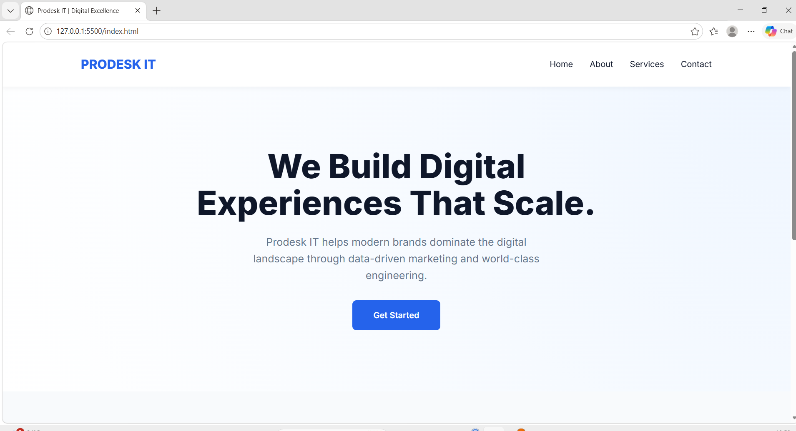
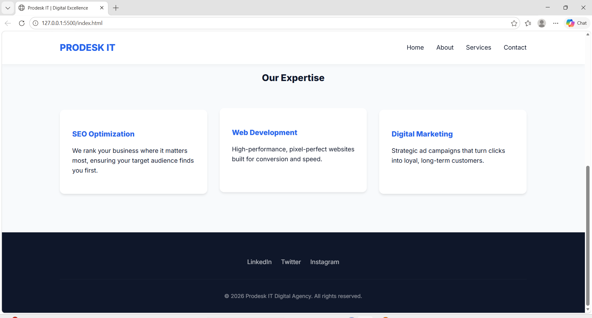

Prodesk IT | Digital Excellence Landing Page
A modern, responsive, and high-performance landing page template designed for digital agencies, IT consultancies, and marketing firms.

Overview
This project is a lightweight, single-page website built with a "mobile-first" approach. It features a clean UI, professional typography using the Inter font family, and a conversion-focused layout.

Key Features
Fully Responsive: Optimized for desktops, tablets, and mobile devices using CSS Grid and Flexbox.

Modern Design: Includes a glassmorphism-inspired sticky navigation and interactive service cards.
Performance Focused: Zero external dependencies (no heavy JS libraries or CSS frameworks), leading to near-instant load times.
Fluid Typography: Uses CSS clamp() for headers to ensure perfect readability across all screen sizes.

Tech Stack
HTML5: Semantic structure for better SEO and accessibility.

CSS3: Custom properties (variables), CSS Grid, and Flexbox for layout management.

Google Fonts: Integrated 'Inter' font for a premium look.

Project Structure
Plaintext
├── index.html   # Main HTML structure and embedded CSS
└── README.md    # Project documentation

Bash
git clone https://github.com/Ragavika/digital-marketing.git
Open the project:
Simply double-click index.html to view it in your preferred browser.

Here are the screenshots of the webpage

